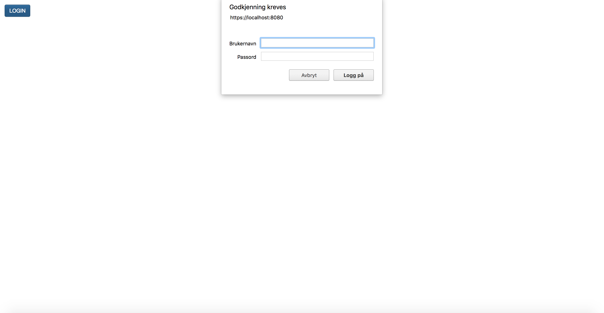
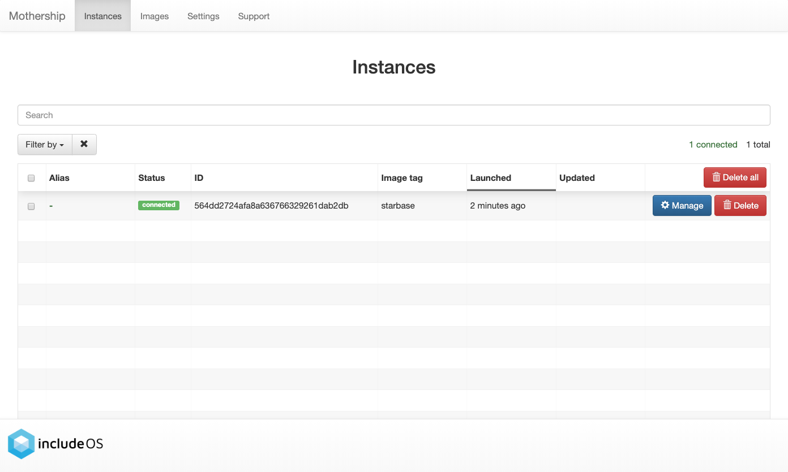

.. _Mothership-server:

Mothership server
=================

Configuration
-------------
All mothership configuration files should be placed in the folder: ``config_files``

Setup authentication
~~~~~~~~~~~~~~~~~~~~

If you want to run your Mothership with authentication (this is default), you need to create a .htpasswd file with one
or more users within the config_files directory:

::

    $ htpasswd -c -B config_files/.htpasswd myuser # create a .htpasswd file and add the user myuser

You will then be prompted to enter a password. Do this.

To add additional users or modify existing ones, leave out the -c option:

::

    $ htpasswd -B config_files/.htpasswd anotheruser

.. _self-signed-tls:

Create self-signed TLS certificate
~~~~~~~~~~~~~~~~~~~~~~~~~~~~~~~~~~

If you want to run your Mothership with TLS (this is default), you need to generate a certificate and a key file in
your mothership directory:

::

    $ openssl req -x509 -newkey rsa:4096 -keyout config_files/key.pem -out config_files/cert.pem -days 365 -nodes

.. important:: This should only be used for testing, and it will require you to confirm the certificate manually in the web browser.

Start Mothership
----------------

Locally
~~~~~~~

::

    $ cd $GOPATH/src/github.com/includeos/mothership
    $ ./mothership serve

If you want to start with a fresh Mothership, meaning you want to delete the images and files you created the last
time you ran your Mothership, you can add the :code:`--clean` option:

::

    $ ./mothership serve --clean

By default the Mothership is also started with the native builder, meaning to build images with your local IncludeOS
installation.

If you want to build your images using Docker, you can add the :code:`--builder docker` option:

::

    $ ./mothership serve --builder docker

To exit the application, press :code:`Ctrl + c`

The default settings when starting a Mothership is to start it with basic authentication and TLS enabled.

If you want to disable authentication and TLS (which you rarely want to), you can start your Motherhip with the
following command:

::

    $ ./mothership serve --noservertls --serverauth none

.. note:: If you want to disable authentication and TLS, you also need to update a constant in the mothership_client so that a Login-button will not be displayed when you visit the Mothership website:

    ::

        $ cd mothership_client
        $ <open the file components/common.js>
        $ <set the constant enableLogin to false>
        $ ./copyfiles.sh

In a Docker container
~~~~~~~~~~~~~~~~~~~~~

::

    $ cd $GOPATH/src/github.com/includeos/mothership

If you want Docker to handle everything for you, from the mothership_client to the IncludeOS installation, you can
do the following:

::

    $ ./build_mothership.sh # instead of `go build mothership.go`
    $ docker run --name mothership --publish 9090:9090 --publish 8080:8080 \
    -v $PWD/config_files:/home/ubuntu/mothership/config_files \
    -v mothership_storage:/home/ubuntu/mothership/runtime_files \
    -v /var/run/docker.sock:/var/run/docker.sock \
    mothership

Exit the container by pressing :code:`Ctrl + c`.

If you want to run the Mothership in Docker but want to change some of the default settings mentioned above, you just
add :code:`serve` at the end, followed by the Mothership options you want to change:

::

    $ docker run --name mothership --publish 9090:9090 --publish 8080:8080 \
    -v $PWD/config_files:/home/ubuntu/mothership/config_files \
    -v mothership_storage:/home/ubuntu/mothership/runtime_files \
    -v /var/run/docker.sock:/var/run/docker.sock \
    mothership serve --builder docker

If you get a Conflict message when starting your Mothership in Docker, remove the previously created container:

::

    $ docker rm mothership

Stop your Mothership container:

::

    $ docker stop mothership # `docker kill mothership` is also an option if this doesn't work

List your running Docker containers:

::

    $ docker ps

List all your Docker containers:

::

    $ docker ps -a

Clean up your Docker environment:

::

    $ docker system prune
    $ <answer y when asked if you want to continue>

Server options
~~~~~~~~~~~~~~

To provide options to mothership there are two possibilities:

1. Launch parameters to ``mothership serve``. Options use the ``--<option>`` format.
2. Options in config file: ``config_files/config.yaml`` supplied in a ``key: value``.

Notable options are::

      --builder string               builder type: native or docker (default "native")
      --certfile string              Certificate file for TLS
      --clean                        <bool, optional> clean everything
      --keyfile string               Private key file for TLS
      --serverauth string            server auth method (default "none")
      --serverport string            port number (default "8080")
      --verboselogging               <bool, optional> verbose logging

Access Mothership
-----------------

cURL
~~~~

To perform authenticated requests with TLS using curl (which is default when starting Mothership), add the :code:`-u` flag to your curl commands:

::

    $ curl -u <username>:<password> https://localhost:8080/images -k

CLI
~~~

To enable the CLI commands to send your credentials when making requests, you can either add the :code:`--username` and :code:`--password` flags to your CLI commands,
or perform :code:`./mothership init` to have the client prompt you for your credentials and store them in a config file for future CLI commands.

::

    $ ./mothership images --username <username> --password <password>

.. _the-website:

Website
~~~~~~~

When you have come this far, or if you want to connect to a public Mothership that is already running, you can open
your browser and go to the Mothership's website.

If you are running a Mothership locally, you will find your Mothership's website by going to
`https://localhost:8080 <https://localhost:8080>`__ if you have started your Mothership with TLS enabled.

If you have started your Mothership without TLS, you will find the website at `http://localhost:8080 <http://localhost:8080>`__.

Here, if the Mothership was started with authentication enabled, you will see a Login-button:

When clicking on this, a popup will appear, asking you to fill in your username and password:

This username and password must match one of the entries in the previously created mothership/config_files/.htpasswd file.

If no authentication is required, you will be sent straight to the Instances page:

