.. _Release notes:

Release notes
=============

.. todo Replace x with correct date

v0.14 September x 2018
--------------------

.. warning::

    All information stored in your Mothership today must be **DELETED** before starting this Mothership version for the first time.
    If you need anything that is stored in your Mothership, take a backup of the ``runtime_files`` folder **BEFORE** starting the Mothership.

    When starting this Mothership version for the first time, add the ``--clean`` flag to the ``mothership serve`` command.
    This will delete all folders in the Mothership's ``runtime_files`` folder, which includes NaCls, images, instances data and more.

.. warning::

    This Mothership release contains **BREAKING CHANGES** and will only work with IncludeOS version v0.12.0-645-g51f6fb3.
    If you need to build with a previous IncludeOS version, you need to checkout the previous release of Mothership.
    All running instances **MUST** be rebuilt and relaunched to be able to receive updates from this Mothership.

- TLS on uplink

    TLS on uplink is now default and all uplink URLs **MUST** start with either ``https://`` (secure / TLS) or ``http://`` (not secure / no TLS).
    An instance running an image where the uplink URL starts with ``http://`` will not be able to connect to a Mothership that has been started with
    TLS on uplink (default). And an instance running an image where the uplink URL starts with ``https://`` will not be able to connect to a Mothership
    that has been started with the ``--nouplinktls`` flag set.

- New instance ID

    UUID is replacing MAC as instance ID

- Persistent information about instances

    All information about an instance is now saved in ``runtime_files/instances``. This means that if a Mothership is restarted, all instances
    registered on the Mothership before the restart will be visible after the restart as well. If an instance has status ``unknown`` after a Mothership restart,
    it means that it has not connected back to the Mothership.

- Delete multiple instances

    On the Instances page you can select multiple (or all) instances and delete them. When deleting an instance, all information stored about the instance will also be deleted.

- Overview of number of instances connected, disconnected, unknown and total

    On the Instances page you get an overview of how many instances have been connected to the Mothership in total, how many are connected now, how many have disconnected and how many we don't know the status of (``unknown``)

- Filter instances by status

    In the GUI you can now filter instances by: Connected, Disconnected, Unknown, Panicked

- Warning icon if an instance has panicked

    A warning icon will be displayed in front of an instance's alias on the Instances page if a panic has occurred. Go to the instance's management page and click on the Panics tab to get more information about the panic(s).

- Management of an instance

    The management page for every instance has been updated with one panel for displaying information about what is actually running on the instance
    and one panel for actions you can take to update the instance.

    In the "Update instance"-panel you can either deploy a previously built image to the instance, or you can "Save, build & deploy" a new one.
    "Save, build & deploy" means:

    1) Save the NaCl changes if any changes have been done (you can edit the NaCl the instance is already running, load another already existing NaCl or create a new NaCl - that's up to you).

    2) Build the image with the specified IncludeOS version, the specified image tag, the NaCl that is shown in the editor and the uplink information that the instance is reporting to the Mothership.

    3) Deploy the built image to the instance.

    If you try to deploy an image with an uplink URL that doesn't match the one that the instance is reporting, you will get a warning. Then you can choose if you want to deploy the image anyway or not.
    You will also get a warning if the image you try to deploy has been uploaded to the Mothership so that the Mothership doesn't know what uplink URL the image has been built with.

    .. image:: _static/images/release-notes-v0.14/update-instance.png

- Upgrade an instance (API endpoint)

    A new API endpoint has been created where you can upgrade an instance, meaning you can build an image for the instance and deploy that image in one go.
    Have a look in the Mothership API documentation (produced by Swagger UI) for more information. A link to this information can be found on your Mothership's Support page.

- Create new image / Save, build & deploy an image

    The Build page has been removed and moved into the Images page (Create new).

    When building, you can now set a custom image name and this will then be used as the image tag.
    This means that when an instance is running this specific image, the instance will report the tag you have given it to Mothership.

- NaCl code snippets

    You can now create your own custom NaCl code snippets when you are creating or editing a NaCl.
    Write the NaCl snippet you want into the editor and click on the "Save as snippet"-button.

    .. image:: _static/images/release-notes-v0.14/snippets.png

- NaCl Timer

    In every NaCl you can now (with IncludeOS version v0.12.0-645-g51f6fb3) create one or more Timer objects that tell the instance running the NaCl to print different information at specific intervals.
    Have a look at the NaCl Timer documentation `here <https://includeos.readthedocs.io/en/latest/NaCl.html#timer>`__.

- When searching through images, also search through the image's uplink information

v0.13 April 16 2018
-------------------

.. note::

    This release contains breaking changes, meaning an IncludeOS instance built with a previous version can not be updated to run an image built with this release's default IncludeOS version (Docker container v0.12.0-rc.4.1).

    Any running instances need to be rebuilt with this release's IncludeOS version and rebooted before new images can be deployed to them.

    Deploying an image to an instance with an incompatible IncludeOS version will result in an error.

    .. image:: _static/images/release-notes-v0.13/settings-includeos.png

- TCP load balancer

NaCl example
::

    Iface uplink {
        index: 0,
        address: 10.0.0.42,
        netmask: 255.255.255.0,
        gateway: 10.0.0.1
    }

    Iface outside {
        index: 1,
        address: 10.0.0.43,
        netmask: 255.255.255.0,
        gateway: 10.0.0.1
    }

    Iface inside {
        index: 2,
        address: 10.0.0.44,
        netmask: 255.255.255.0,
        gateway: 10.0.0.1
    }

    Load_balancer lb {
      layer: tcp,
      clients: {
            iface: outside,
            port: 80,
            wait_queue_limit: 1000,
            session_limit: 1000
        },
        servers: {
            iface: inside,
            algorithm: round_robin,
            pool: [
                {
                    address: 10.0.0.10,
                    port: 80
                },
                {
                    address: 10.0.0.11,
                    port: 80
                },
                {
                    address: 10.0.0.12,
                    port: 80
                }
            ]
        }
    }

For more information, visit the `NaCl documentation page <https://includeos.readthedocs.io/en/latest/NaCl.html#load-balancer>`__.

- New Instances, NaCl and Images tables, with sort functionality

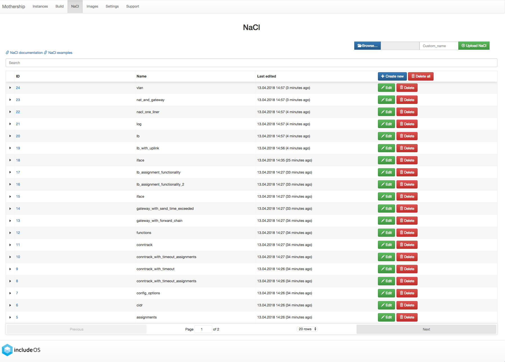

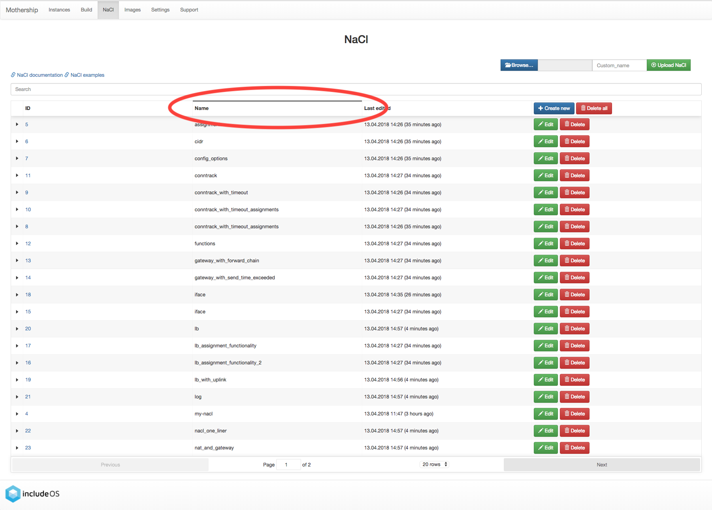

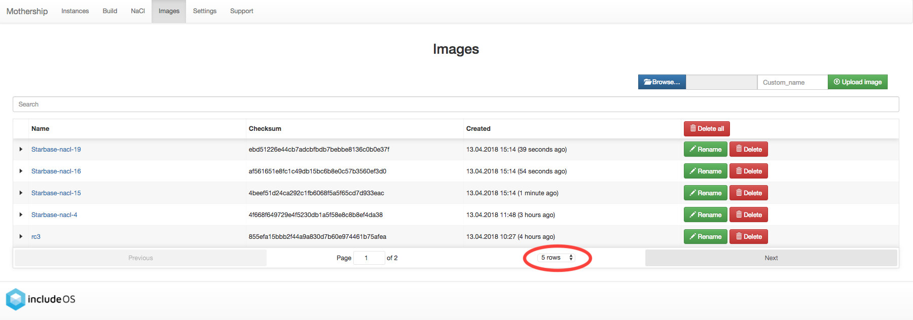

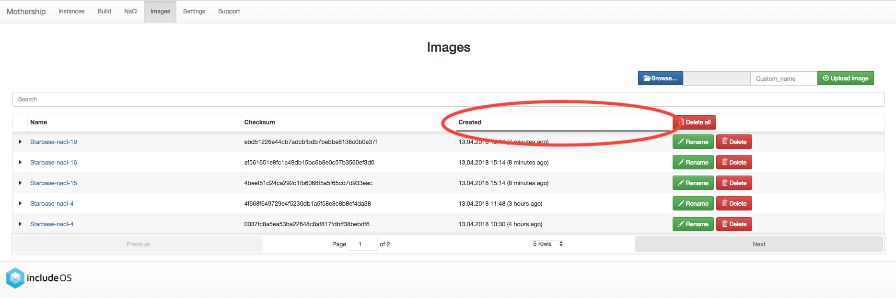

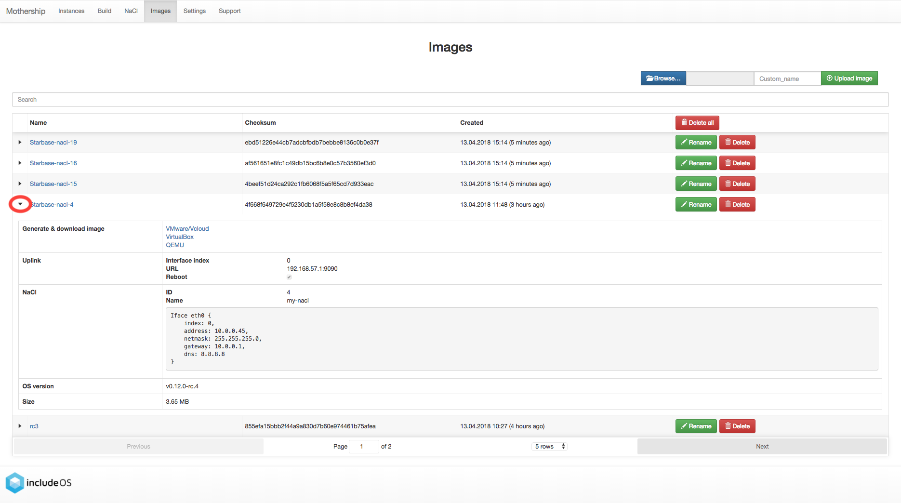

- New Mothership log view on the Settings page

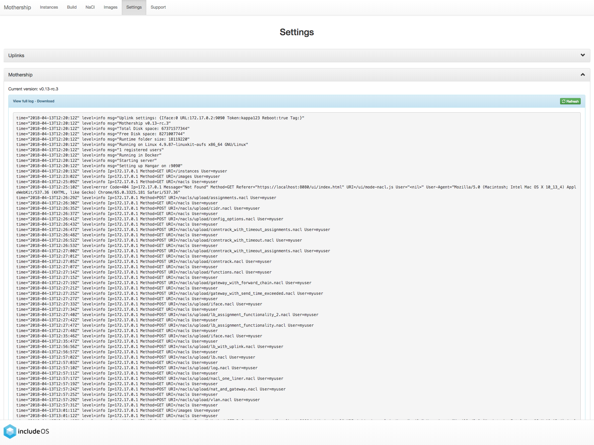

- Internal stability improvements

v0.12 March 12 2018
-------------------

GUI
~~~

- Description field added per instance, which is persistent

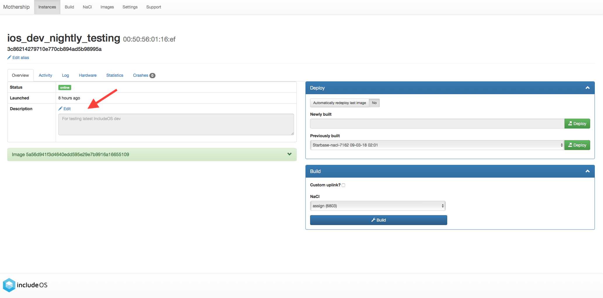

- Search functionality on the Instances, Images and NaCl pages

    - Image search targets:
        - Checksum (ID)
        - Name
        - OS version
        - NaCl name
    - Instance search targets:
        - ID
        - UUID
        - Alias
        - Description
        - IP addresses
        - Running image's checksum (ID)
        - Devices
    - NaCl search targets:
        - ID
        - Name
        - Content

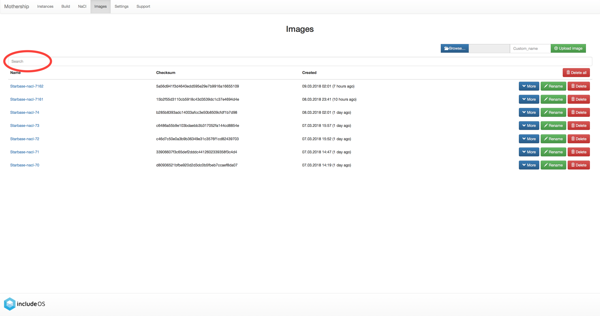

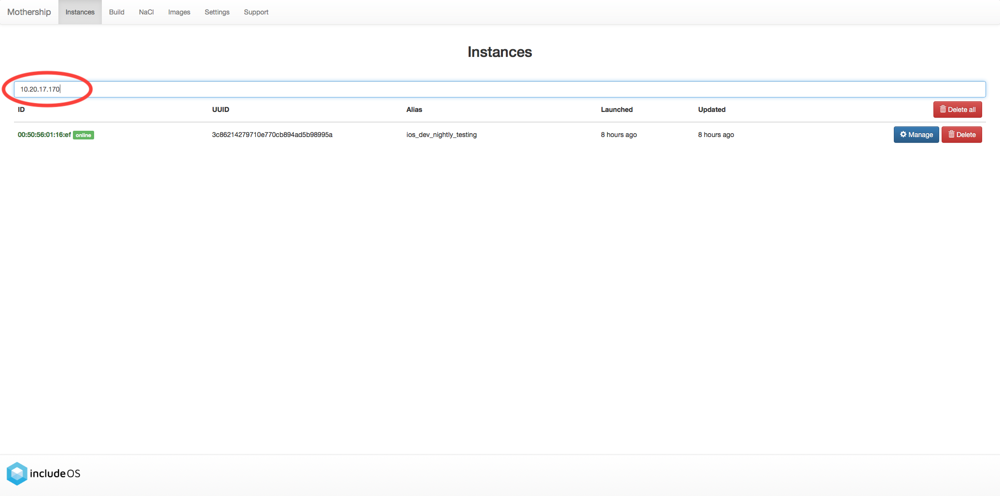

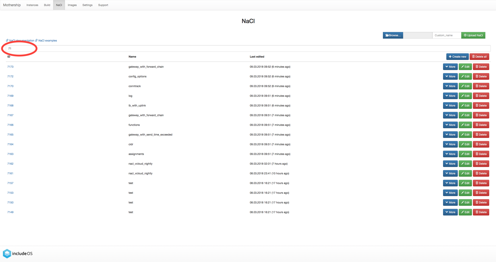

- Pagination on the Instances, Images and NaCl pages (20 elements per page)

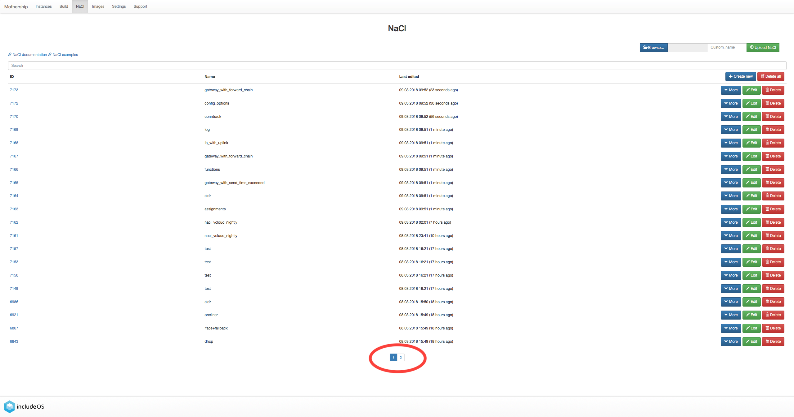

Internal improvements
~~~~~~~~~~~~~~~~~~~~~

- Authentication, TLS and docker builder are default when starting Mothership
- Improved logging
