.. _Using-mothership:

Using Mothership
================

Your first IncludeOS instance
-----------------------------

1. Create a configuration for your instance
^^^^^^^^^^^^^^^^^^^^^^^^^^^^^^^^^^^^^^^^^^^

**Go to the Images page**

Here you get an overview of all your images and you can upload, delete or create a new image.

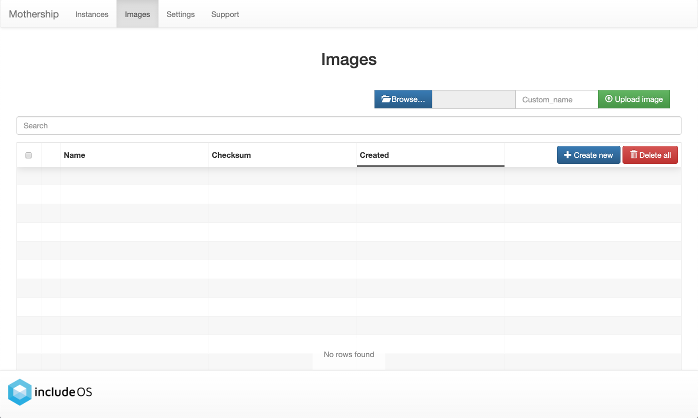

Click on the Create new-button. In the view that is displayed you can set a custom name of the image you
would like to build and select the IncludeOS version, NaCl and uplink to build with.

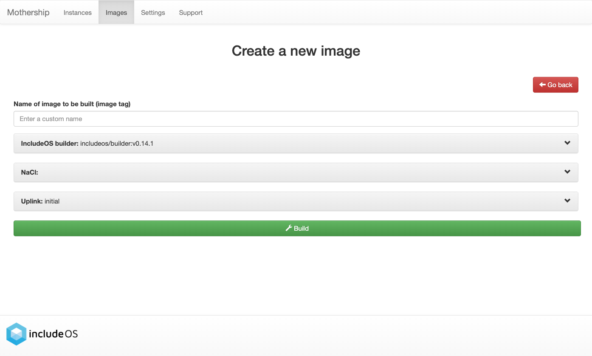

**Expand the NaCl panel**

NaCl is a configuration language for IncludeOS. In the NaCl panel you can find links to the language
documentation and examples.

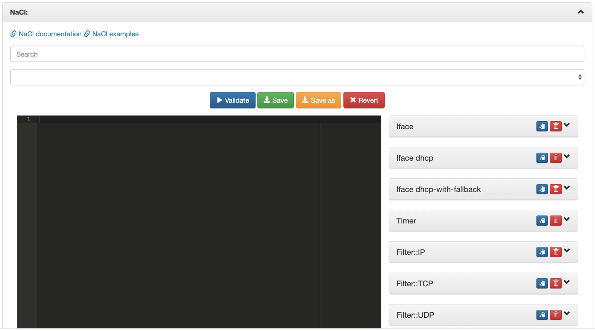

**Write your NaCl configuration**

In the list on the right-hand side you have easy access to a set of NaCl code snippets.
Click on the copy-button for the code snippet named 'Iface'. This will paste the NaCl you need for
configuring an instance with one interface into the editor. Change the Iface values to fit your need.
If you want the interface to get configured via DHCP, click on the code snippet named 'Iface dhcp'.

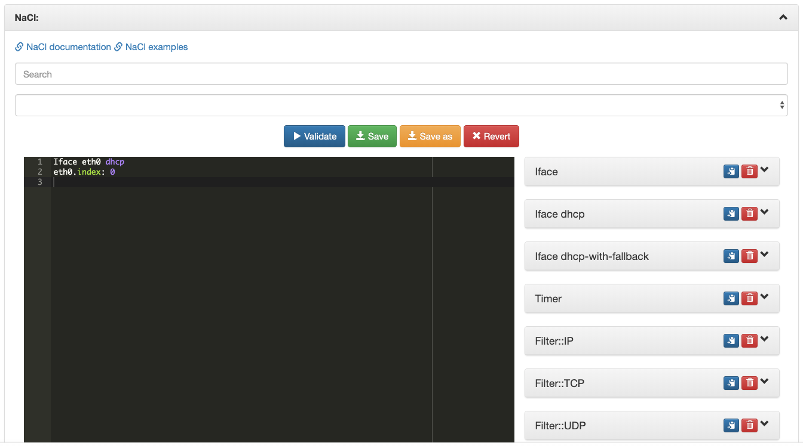

**Click on the Validate-button to validate the NaCl content**

If there are any errors in your NaCl configuration, an error icon will be displayed in the left margin of the line
containing the error. When hovering this icon, the reason for the error will be displayed:

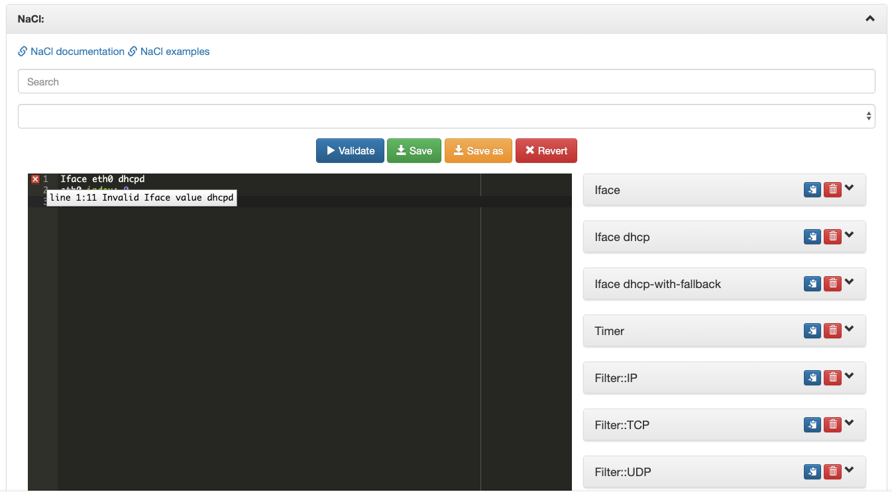

**Save your NaCl**

Click on the Save as-button. A modal will be displayed where you can give your configuration a name and
save it as a NaCl or a snippet. Give your NaCl a name and click on the Save as new NaCl-button.

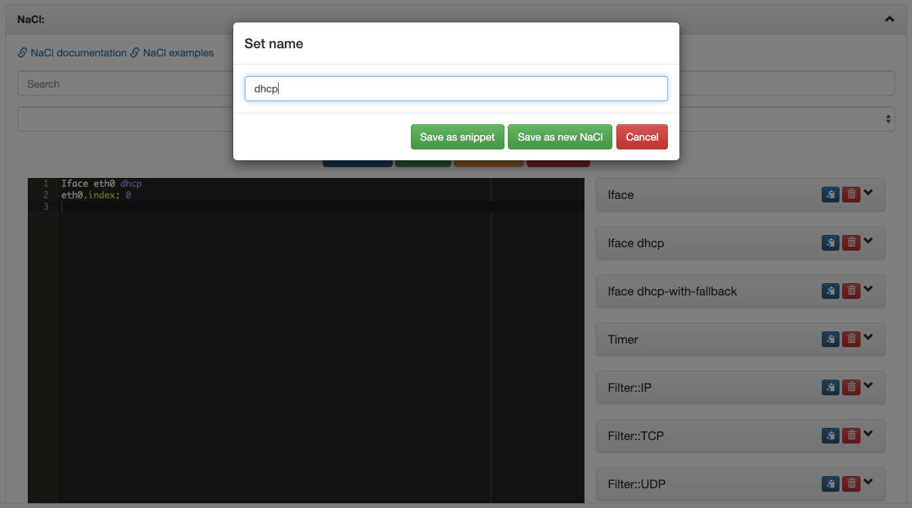

If no errors occur, your NaCl will show up in the drop-down list and be the selected NaCl for your image.

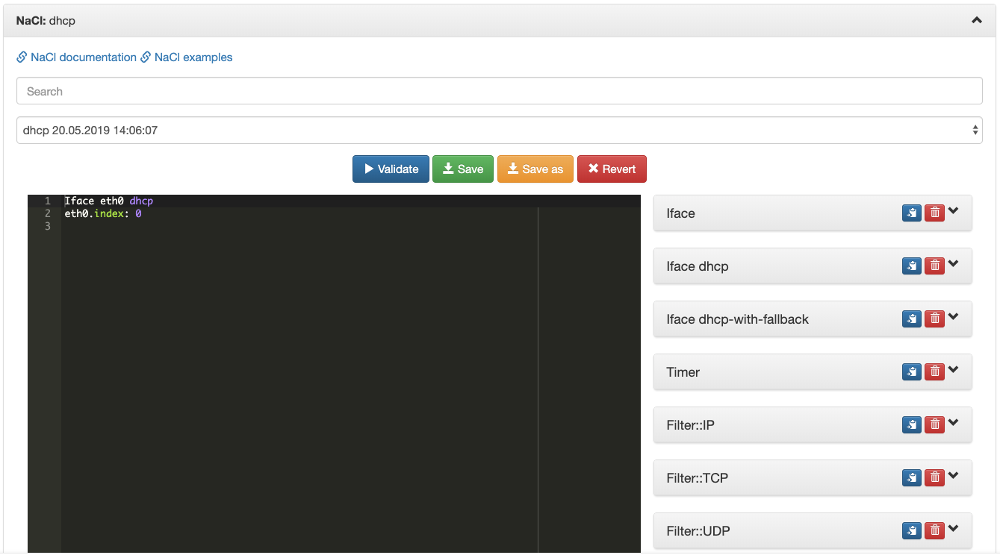

2. Select the uplink destination that your instance will connect to
^^^^^^^^^^^^^^^^^^^^^^^^^^^^^^^^^^^^^^^^^^^^^^^^^^^^^^^^^^^^^^^^^^^

**Expand the uplink panel**

When building an image, information about the URL of the Mothership to connect to must be given. This is what we call
an uplink. The initial uplink that is created when starting a Mothership is set to be the IP of your Mothership and
port 9090. On the Create new image-page there is an uplink panel where you can select the uplink you want to use
for your image.

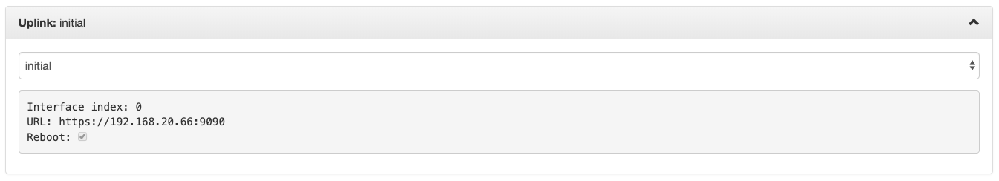

You can create, view and edit uplinks on the Settings page.

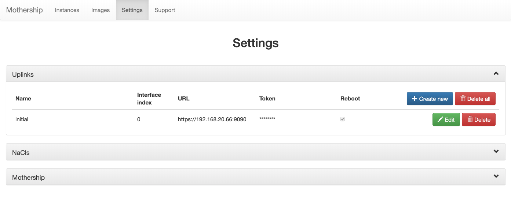

3. Select the IncludeOS version to build with
^^^^^^^^^^^^^^^^^^^^^^^^^^^^^^^^^^^^^^^^^^^^^

**Expand the IncludeOS-builder panel**

The latest version is pre-selected, but you can choose a different IncludeOS version in this panel.

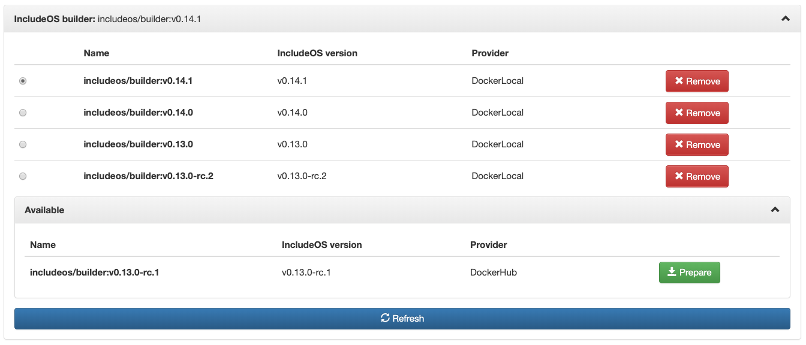

4. Build your image
^^^^^^^^^^^^^^^^^^^

You have now selected an IncludeOS version, a NaCl and an uplink for your new instance. You can also
give your image a name and when booted up, the instance running this image will report the name.

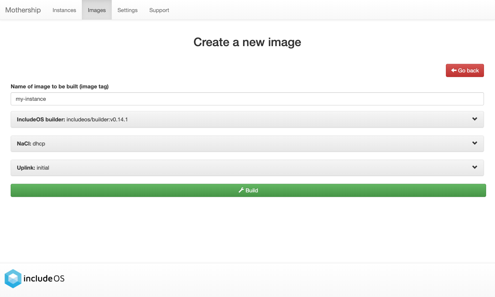

**Click on the Build button**

The status of the build is displayed in a modal.

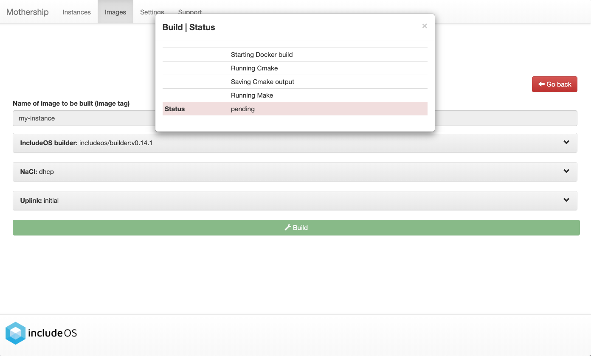

If everything went well you will be sent back to the Images page and a confirmation box will appear saying that
the image was successfully built. You will see your newly created image on the page.

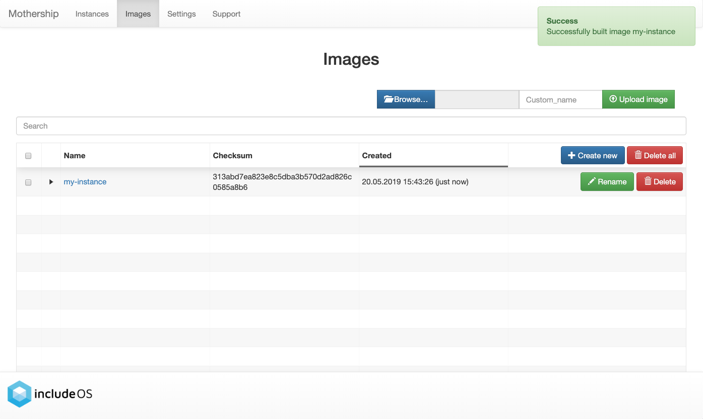

**Download the image**

Download the image by clicking on the image name.

You can click on the arrow to the left of each image for more information about it:

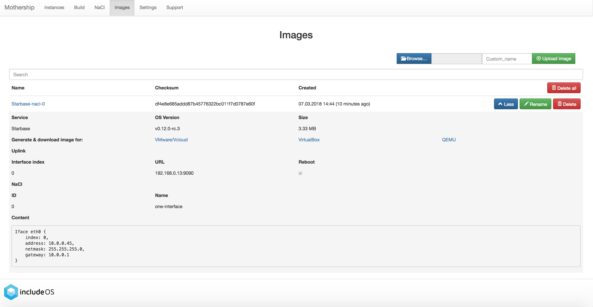

5. Boot
^^^^^^^

After you have downloaded the image, you can launch it on your preferred hypervisor (the
:code:`./mothership launch --hypervisor <hypervisor> <ELF-binary>` command is useful here - see our
:ref:`hypervisors` documentation), or you can use the IncludeOS :code:`boot` command.

::

    $ ./mothership launch --attach --hypervisor vmware my-instance

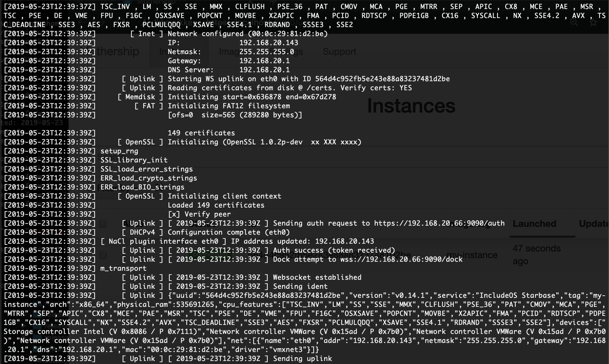

**Go to the Instances page**

On the Instances page, you will see your instance when it has connected to the Mothership:

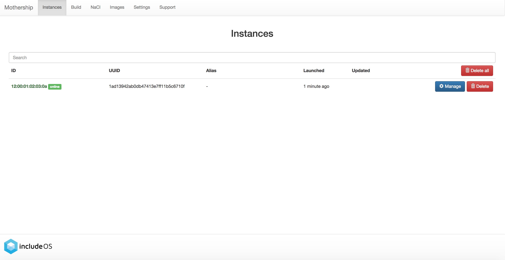

Update your IncludeOS instance
------------------------------

**Go to the Instances page**

If you want to update your instance to run another image, click on the **Manage** button.
On the management page for your instance you will get an overview of the instance, with several tabs containing
more information.

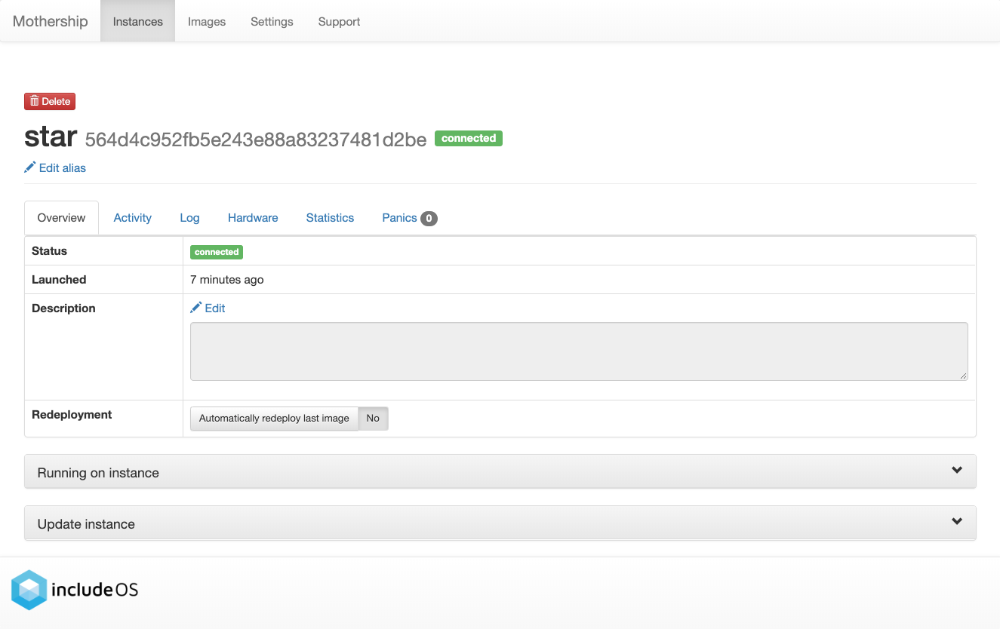

Below the overview section, you will see two more sections:

  1. Running on instance
  2. Update instance

The Running on instance-section will give you an overview of the image running on the instance, with
information about uplink, IncludeOS version and NaCl information if this is known to the Mothership.

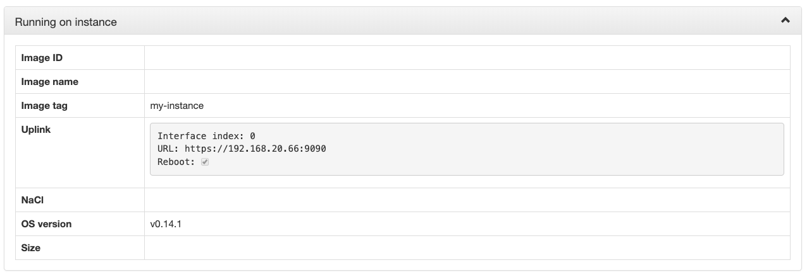

**Expand the Update instance panel**

In the Update instance panel, you will be able to choose how you want to update your instance.

  1. Build & deploy a new image

  This section allows you to build a new image and deploy it to your instance. Here you can choose an
  IncludeOS version, configure a NaCl and give your new image a name, and after the image has been
  built it will automatically be deployed to the instance.

  2. Deploy a previously built image

  In this section you can deploy one of your previously built or uploaded images to your instance.
  Choose an image from the drop-down list and click on the Deploy-button.

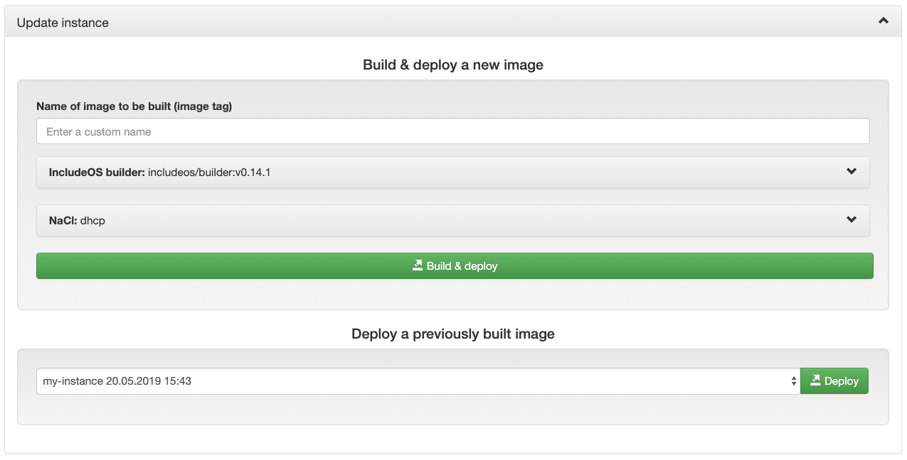

**Build & deploy a new image**

Let's say you want to build and deploy a new image to your instance; Fill in your new image tag
(if you want to change it), optionally choose another IncludeOS version, and select or create a
new NaCl (here we've created a new NaCl, containing a Timer that makes the instance report CPU
and memory usage together with a timestamp every 30 seconds).

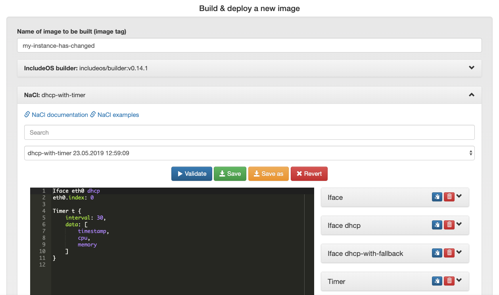

The information in the Running on instance panel will change after a successful deployment, and
will display what is now running on the instance:

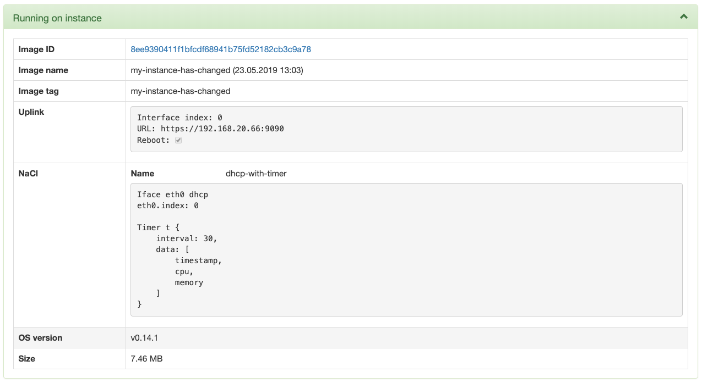
