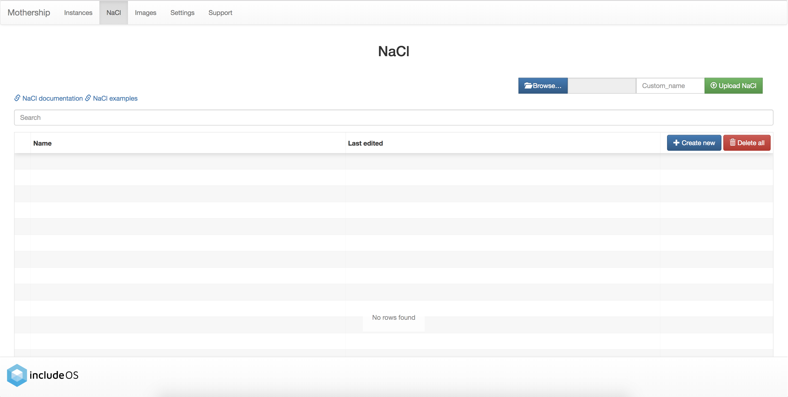
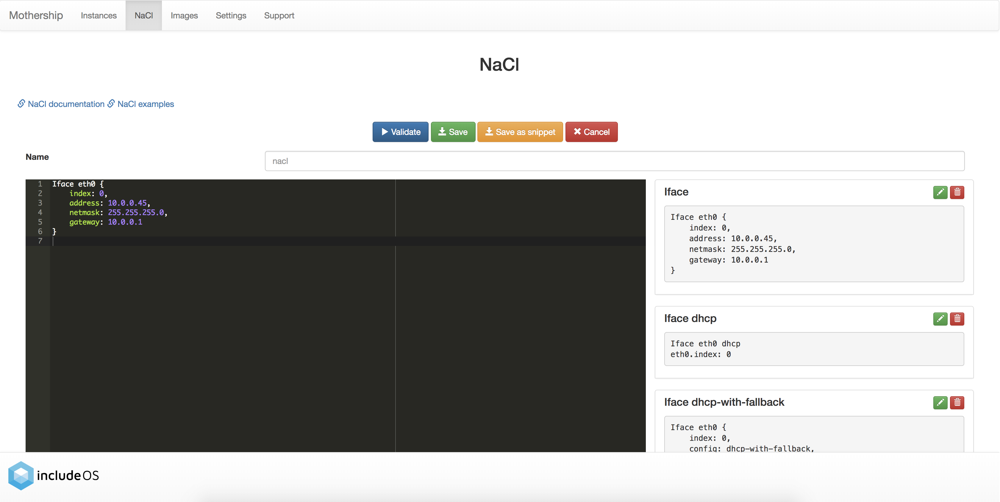
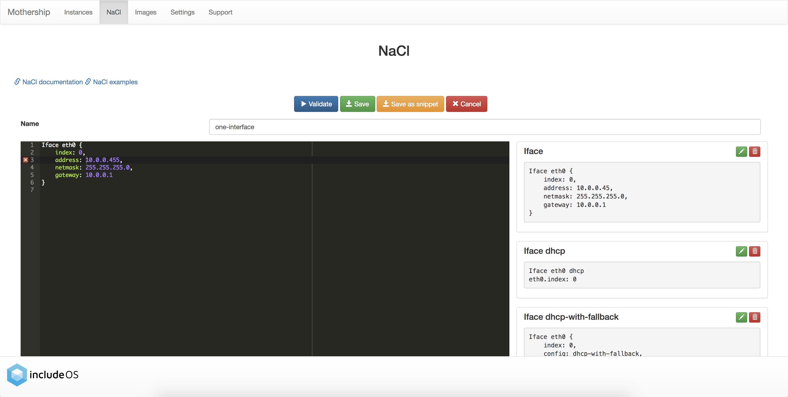
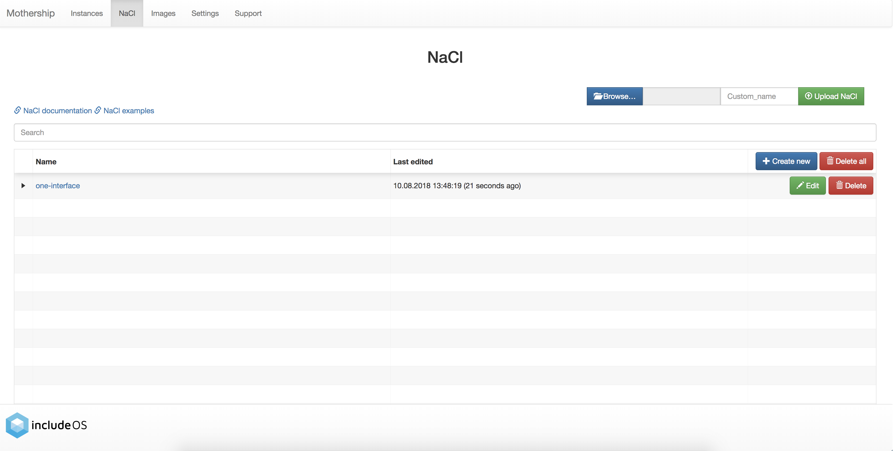
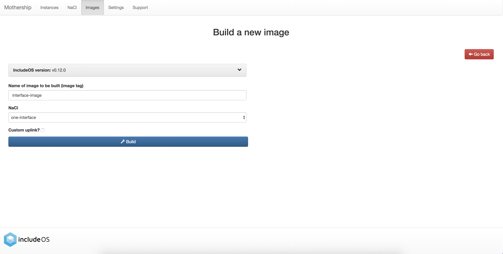
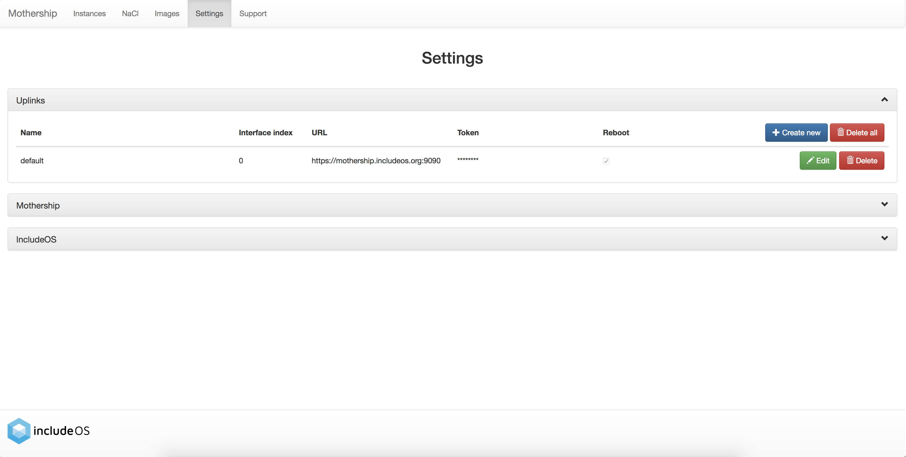
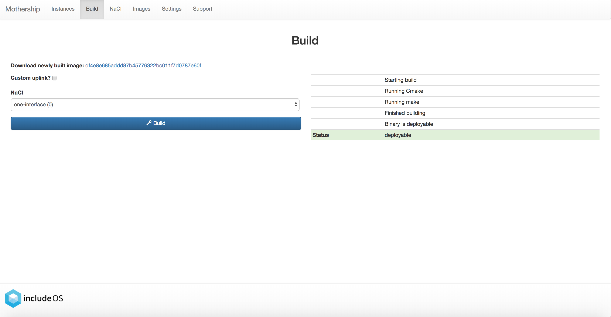
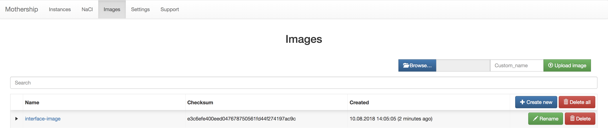
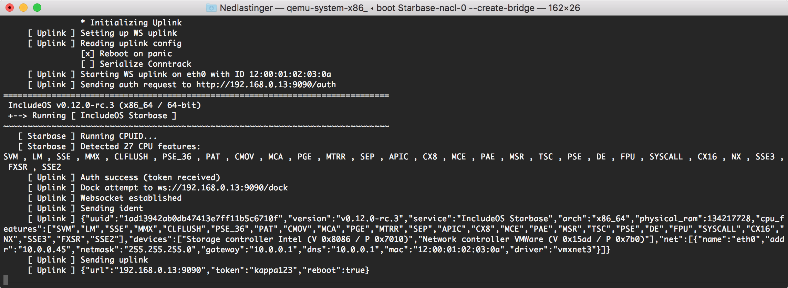

.. _Your first IncludeOS instance:

Your first IncludeOS instance
=============================

1. Create a configuration for your instance
-------------------------------------------

**Go to the NaCl page**

NaCl is a configuration language for IncludeOS. On the NaCl page you can find links to the language documentation and examples.

**Click on the Create new-button**

**Click on the code snippet named Iface**

This will paste the NaCl you need for configuring an instance with one interface. Change the Iface values to fit your need and give your NaCl file a name.

**Click on the Validate-button to validate the NaCl content**

If there are any errors in your NaCl configuration, an error icon will be displayed in the left margin of the line containing the error. When hovering this icon, the reason for the error will be displayed:

**Click on the Save-button**

The newly created NaCl file is displayed in the list if the NaCl content doesn't contain any errors:

2. Build your image
-------------------

If you are running Mothership with the native builder, you need to have IncludeOS installed on your machine. The IncludeOS documentation can be found `here <http://includeos.readthedocs.io>`__.

**Go to the Build page**

Here you will see that your newly created NaCl is displayed in the drop-down list:

When building an image, information about the URL of the Mothership to connect to must be given. This is what we call an uplink. The default uplink that is created when starting a Mothership is set to be the IP of your Mothership and port 9090. You can view and edit the default uplink settings to your Mothership on the Settings page. Here you can also create other uplinks.

On the Build page you are asked if you want to use a custom uplink for this build. If the default uplink on the Settings page is the uplink you want to use, you don't need to check this. If you have another uplink you would like to use, however, check the box and a drop-down list containing the names of all your uplinks will be displayed. Choose one of these.

**Click on the Build button**

The status of the build is displayed on the right-hand side, and if everything went well, the status ``deployable`` will be seen at the bottom.

**Download the image**

You can also see that the image's checksum is displayed on the Build page after a successful build, and if you click on this you will download the image.

For more information about the image you have built, go to the Images page. All your built images will be displayed here and you can also upload images that you have built without using Mothership.

Click on an image's More-button for more information about the image:

.. image:: _static/images/images-more.png

3. Boot
-------

After you have downloaded the image, you can launch it on your preferred hypervisor (the :code:`./mothership launch --hypervisor <hypervisor> <ELF-binary>` command is useful here - see our :doc:`Hypervisors` documentation), or you can boot it up locally:

.. ip forwarding on if uplink 192...., else 10.0.0.1 f.ex.
.. vm.json (net devices, specify uuid if booting locally on mac f.ex.)

::

    $ boot Starbase-nacl-0 --create-bridge

On the Instances page, you will see your instance when it has connected to the Mothership successfully:

.. image:: _static/images/instances-with-content.png
