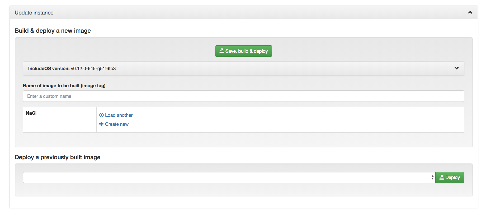
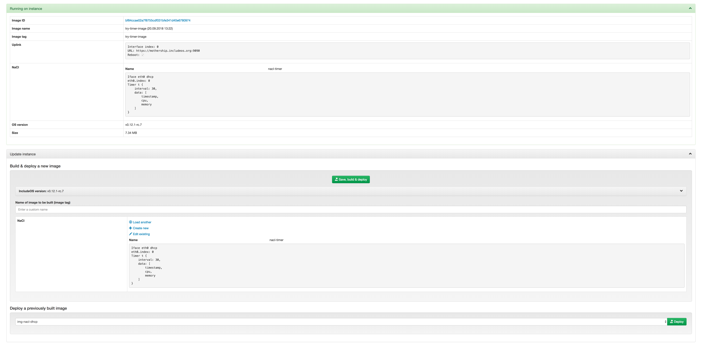
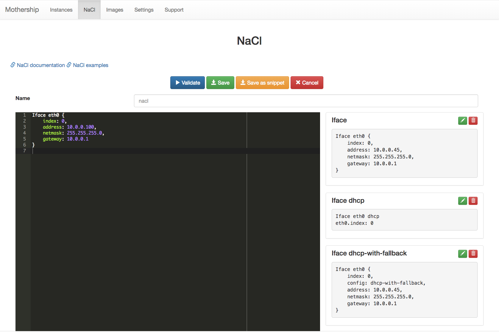

v0.14 October 8 2018
----------------------

.. warning::
    It is recommended to **DELETE** all existing files before starting this Mothership version for the first time.
    For more info about migrating to this new release see: :ref:`migrating_13_14`

.. warning::
    With the release of IncludeOS version v0.13.0-rc.1 a change to Liveupdate means that all existing Starbases **MUST** be changed.
    This means that all running instances **MUST** be rebuilt and relaunched.
    Any attempt to deploy a new image to an instance running an old IncludeOS version is not guaranteed to work correctly.

.. warning::
    This Mothership release contains **BREAKING CHANGES** and will only work with IncludeOS version v0.12.0-645-g51f6fb3 or newer.
    If you need to build with a previous IncludeOS version, you need to checkout the previous release of Mothership.
    All running instances **MUST** be rebuilt and relaunched to be able to receive updates from this Mothership.

- TLS on uplink

    TLS on uplink is now default and all uplink URLs **MUST** start with either ``https://`` (secure / TLS) or ``http://`` (not secure / no TLS).
    An instance running an image where the uplink URL starts with ``http://`` will not be able to connect to a Mothership that has been started with
    TLS on uplink (default). And an instance running an image where the uplink URL starts with ``https://`` will not be able to connect to a Mothership
    that has been started with the ``--nouplinktls`` flag set.

- New instance ID

    UUID is replacing MAC as instance ID

- Persistent information about instances

    All information about an instance is now saved in ``runtime_files/instances``. This means that if a Mothership is restarted, all instances
    registered on the Mothership before the restart will be visible after the restart as well. If an instance has status ``unknown`` after a Mothership restart,
    it means that it has not connected back to the Mothership.

- Delete multiple instances

    On the Instances page you can select multiple (or all) instances and delete them. When deleting an instance, all information stored about the instance will also be deleted.

- Overview of number of instances connected, disconnected, unknown and total

    On the Instances page you get an overview of how many instances have been connected to the Mothership in total, how many are connected now, how many have disconnected and how many we don't know the status of (``unknown``)

- Filter instances by status

    In the GUI you can now filter instances by: Connected, Disconnected, Unknown, Panicked

- Warning icon if an instance has panicked

    A warning icon will be displayed in front of an instance's alias on the Instances page if a panic has occurred. Go to the instance's management page and click on the Panics tab to get more information about the panic(s).

- Management of an instance

    The management page for every instance has been updated with one panel for displaying information about what is actually running on the instance
    and one panel for actions you can take to update the instance.

    In the "Update instance"-panel you can either deploy a previously built image to the instance, or you can "Save, build & deploy" a new one.
    "Save, build & deploy" means:

    1) Save the NaCl changes if any changes have been done (you can edit the NaCl the instance is already running, load another already existing NaCl or create a new NaCl - that's up to you).

    2) Build the image with the specified IncludeOS version, the specified image tag, the NaCl that is shown in the editor and the uplink information that the instance is reporting to the Mothership.

    3) Deploy the built image to the instance.

    If you try to deploy an image with an uplink URL that doesn't match the one that the instance is reporting, you will get a warning. Then you can choose if you want to deploy the image anyway or not.
    You will also get a warning if the image you try to deploy has been uploaded to the Mothership so that the Mothership doesn't know what uplink URL the image has been built with.

- Upgrade an instance (API endpoint)

    A new API endpoint has been created where you can upgrade an instance, meaning you can build an image for the instance and deploy that image in one go.
    Have a look in the Mothership API documentation (produced by Swagger UI) for more information. A link to this information can be found on your Mothership's Support page.

- Create new image / Save, build & deploy an image

    The Build page has been removed and moved into the Images page (Create new).

    When building, you can now set a custom image name and this will then be used as the image tag.
    This means that when an instance is running this specific image, the instance will report the tag you have given it to Mothership.

- NaCl code snippets

    You can now create your own custom NaCl code snippets when you are creating or editing a NaCl.
    Write the NaCl snippet you want into the editor and click on the "Save as snippet"-button.

- NaCl Timer

    In every NaCl you can now (with IncludeOS version v0.12.0-645-g51f6fb3) create one or more Timer objects that tell the instance running the NaCl to print different information at specific intervals.
    Have a look at the NaCl Timer documentation `here <https://includeos.readthedocs.io/en/latest/NaCl.html#timer>`__.

- NaCl Iface

    The members buffer_limit and send_queue_limit have been added, and the Vlan type has been removed and incorporated into Iface. See the updated Iface documentation `here <https://includeos.readthedocs.io/en/latest/NaCl.html#iface>`__.

- When searching through images, also search through the image's uplink information

.. _migrating_13_14:

Migrating from old release
~~~~~~~~~~~~~~~~~~~~~~~~~~
Due to internal changes to how files are stored in this release of Mothership it is highly recommended to perform a deletion of all old files. This will affect:

- NaCls
- Images
- Uplinks
- Issues
- Instance logs and history

If you need anything that is stored in your Mothership, take a backup of the ``runtime_files`` folder **BEFORE** starting the Mothership.  To upgrade from a previous Mothership version to v0.14 we recommend the following procedure:

1. Perform a backup of all information that should be kept. Scripting this with the Mothership CLI is possible. Example shows how all the existing NaCls are pulled and stored: ::

    $ nacls=("$(<mothership-bin> nacls -o id)")
    $ for i in ${nacls[@]}; do <mothership-bin> pull-nacl "$i"; done
2. Launch Mothership with the ``--clean`` option, this will erase all persistent information.
3. Upload any files from the backup that should be available on the new Mothership.
