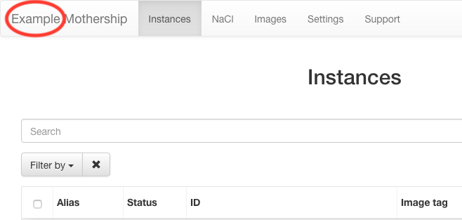
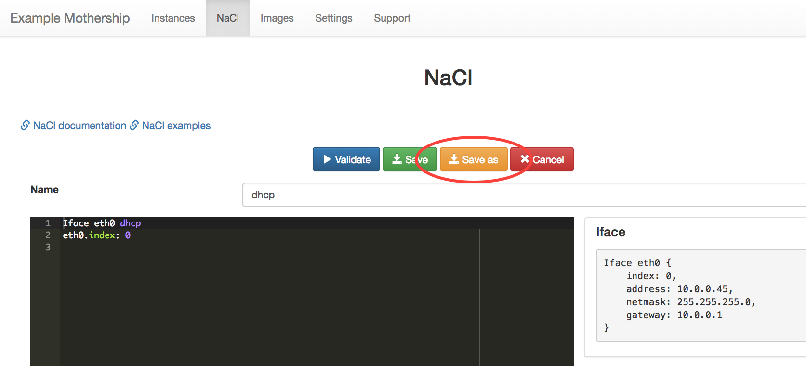
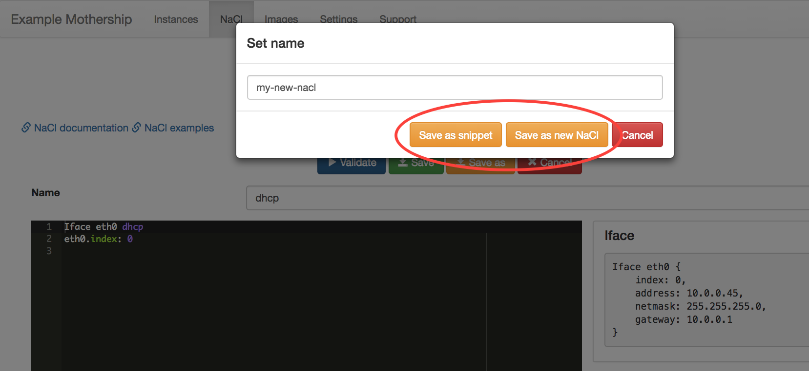
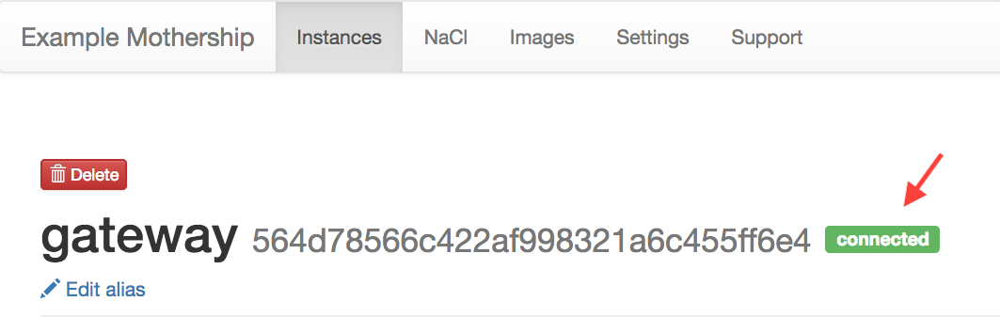
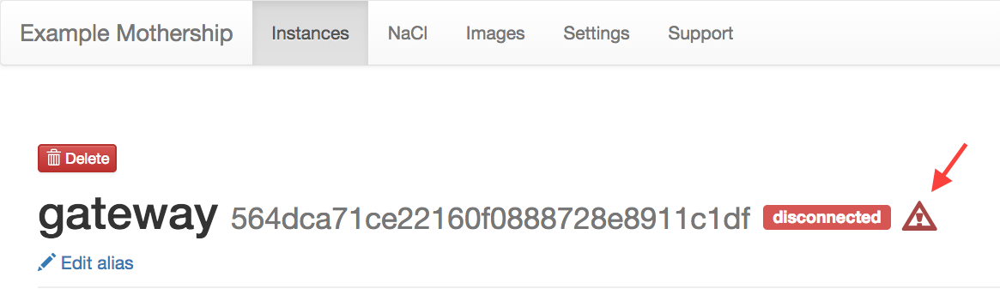
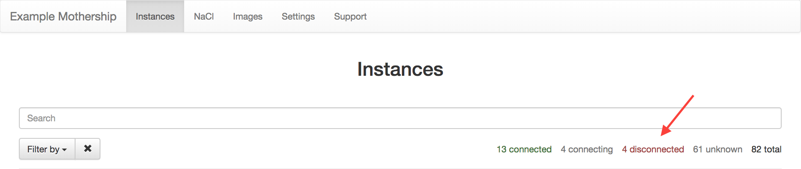

v0.15 October 29 2018
----------------------

- **Set and get name of Mothership**

    It is now possible to give Mothership a name that shows up in the GUI: ::

    $ mothership serve --name example

    This name will then be available from the ``/info/name`` API endpoint. It shows up in the Mothership GUI as such:

- **InfluxDB**

    It is now possible to send Mothership metrics and IncludeOS instance stats to InfluxDB, which
    enables you to query and visualize metrics and stats using standard TICK Stack components.
    To enable the InfluxDB integration, add ``--metricsreporter influxdb`` when starting your Mothership server.

    .. note::

        Before enabling metrics and stats reporting to InfluxDB, you must create the required InfluxDB databases.
        Mothership writes stats to a database called ``instance_stats`` and metrics to a database called ``mothership``.
        Create these databases and set appropriate retention policies on them before you start using ``--metricsreporter influxdb``
        as part of your Mothership startup command.

    The address and (optional) user name and password for the InfluxDB server are specified as environment variables.

    The following variables can be specified:

    ::

        INFLUXDB_ADDR
        INFLUXDB_USERNAME
        INFLUXDB_PASSWORD

    If you have more than one Mothership, it is highly recommended to set the name of your Mothership using the
    aforementioned ``--name`` command line option.

- **Better file names when downloading images for hypervisor**

    When you build an image, for example an initial Starbase, and you use "Generate & download image"
    to download a bootable image for a specific hypervisor, the filename now includes the image tag (if set)
    and the IncludeOS version the image was built with.

- **A NaCl Save as-option has been added**

    This is available when you are creating or editing a NaCl in the editor.
    It makes it possible to save the NaCl editor-content as a new NaCl or as a snippet.

- **The header on the Manage instance-page has been updated**

    The header now shows the status of the instance (connected / disconnected / connecting / unknown).
    It also shows a red warning sign if the instance has panicked. The warning sign is visible immediately
    after the Mothership has been notified about the panic.

- **The statuses displayed above the list of instances on the Instances page are now updated dynamically**

    This means that the number of instances for **every** status that one of the instances have will be displayed.

- **Internal improvements**

    Internal stability and performance improvements.
