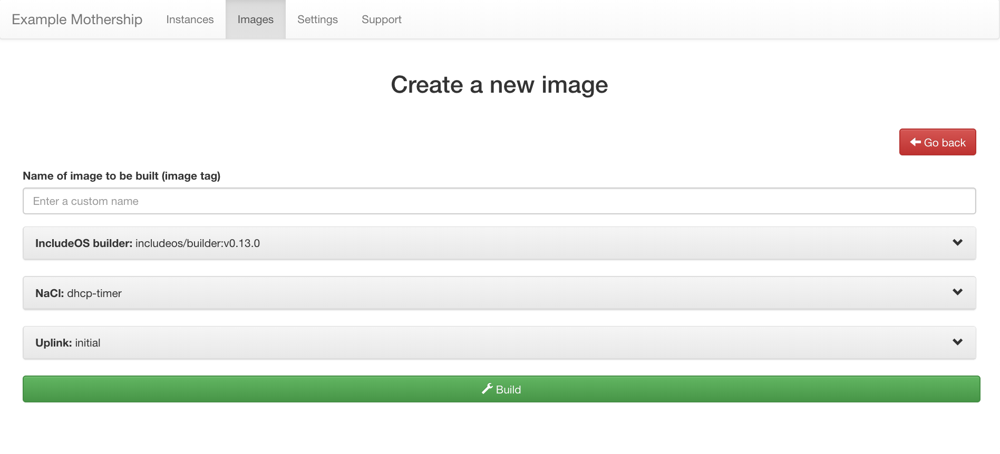
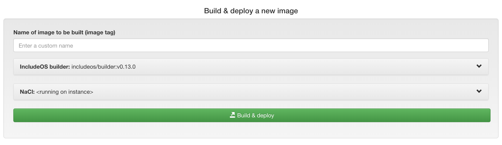
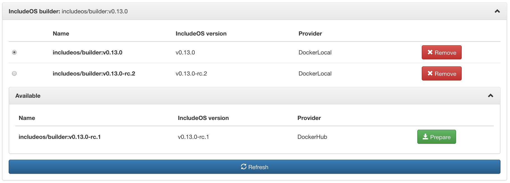
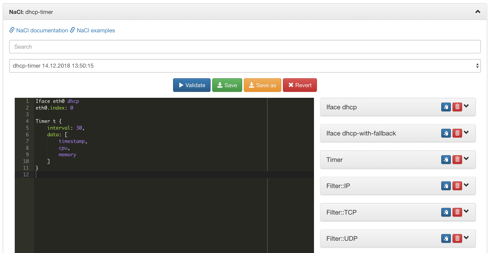
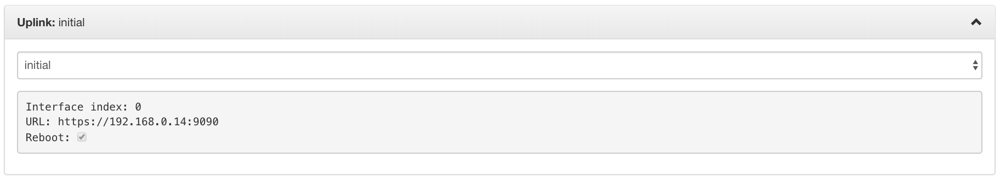

v0.16 December 18 2018
----------------------

Before starting this release
~~~~~~~~~~~~~~~~~~~~~~~~~~~~

.. warning::
    It is recommended to **DELETE** all existing files in the ``runtime_files`` folder before starting
    this Mothership version for the first time. Take a backup of the folder if there's anything you need.

Mothership API 1.0
~~~~~~~~~~~~~~~~~~

The Mothership API has been streamlined. All API endpoints are now served under the **/v1** path prefix.

In general, almost all Mothership API calls return a JSON response. But for some resources, clients can get
a binary or textual representation of the requested resource by specifying the desired **Content-Type**
using the HTTP "Accept" header. For example, to get (JSON) information about an image, set the "Accept"
header to "application/json", but to download the actual binary image, set the "Accept" header to
"application/octet-stream", etc.

**Some endpoints have changed**. See the interactive API documentation for details about individual API calls.
A link to this documentation can be found on the Support page of your Mothership.

.. note::

    **Fetching all instances** now gives you a JSON array, not a map.

.. note::

    All **uplinks** now have an ID.

.. note::

    When building an image or validating a NaCl, you must now provide the ID of an IncludeOS builder.
    **Builders and Bobs** are new concepts that are introduced in this release and enable users to build
    with different IncludeOS versions at the same time. Each builder is a Docker container that contains a
    specific version of IncludeOS. For more information, see :ref:`bobs-and-builders`.

GUI
~~~

New "Create new image" and "Update instance" sections
^^^^^^^^^^^^^^^^^^^^^^^^^^^^^^^^^^^^^^^^^^^^^^^^^^^^^

The **NaCl page has been removed** and a lot of the functionality has been moved into the Create new image-page:

The same functionality is available on the management page for each instance as well, in the Update instance-panel:

- **Custom image name**

At the top is a field where you can set the name of your image, which will also be a tag that the instance
running this image will report to the Mothership.

- **The IncludeOS builder-panel**

Below the custom name-field is an IncludeOS builder-panel. This panel contains a list of IncludeOS builders
(Docker containers that each contain a specific version of IncludeOS). There is no longer a
global IncludeOS version, so every user can select which builder to build an image with independent
of what other users choose. For more information, see :ref:`bobs-and-builders`.

The IncludeOS-panel on the Settings page has been removed because of this.

- **The NaCl panel**

The content of the NaCl-panel is in large part the same as on the old NaCl page.
Select a NaCl in the drop-down list and the content of this will be displayed in the editor.
Validate, save or revert your changes, or save the content of the editor as a new NaCl or a new snippet.

Snippets are displayed on the right-hand side as before, but now take up a lot less space.
Copy the snippet into the editor or delete or edit it.

To delete NaCls, go to the NaCls panel on the Settings page.

On the management page for an instance, the NaCl that the instance is running will also be an option in the drop-down list.
This NaCl can not be edited directly (the content is built into the image that the instance is running),
but you can edit the content of the editor and save the content as a new NaCl (Save as).

- **The Uplink panel**

This will only be displayed on the Create new image-page because each instance will reuse
its uplink on the management page for the instance.

